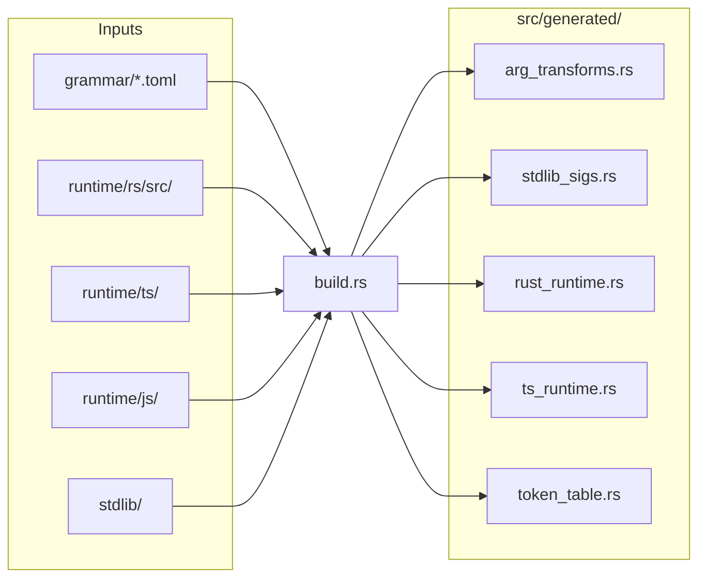
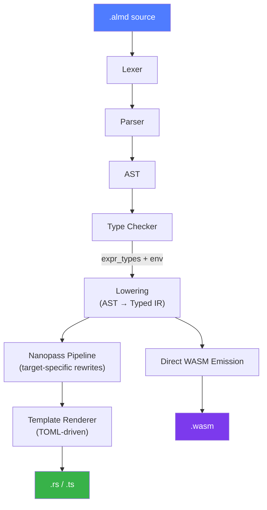
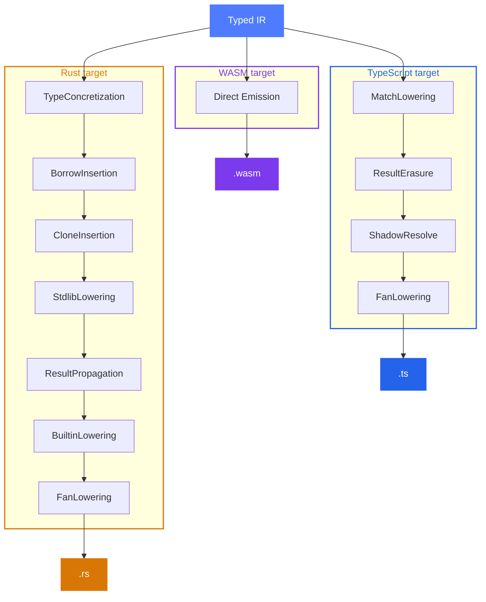

import { Tabs, TabItem, Aside, Card, CardGrid, Steps } from '@astrojs/starlight/components';

Almide is a **~22,000-line pure-Rust compiler** with minimal dependencies: `serde` (AST serialization), `toml` (template loading), `clap` (CLI).

## Pipeline

The compiler operates in two phases: **build time** (when the compiler itself is built) and **run time** (when your `.almd` source is compiled).

### Build time — `cargo build`



<Aside>
  The runtime is **embedded in the compiler binary**. When emitting JS/TS, the runtime preamble is prepended to the output. No external runtime package needed.
</Aside>

### Run time — `almide run`



<Steps>
1. **Lexer** — Source text → token stream. Handles string interpolation, heredocs, 42 keywords.

2. **Parser** — Recursive descent. Produces AST with span information. Error recovery with actionable hints.

3. **Type Checker** — Constraint-based inference with eager unification. Resolves UFCS calls (`xs.map(f)` → `list.map(xs, f)`).

4. **Lowering** — AST + type information → Typed IR. Every expression carries its resolved type.

5. **Nanopass Pipeline** — Target-specific structural rewrites on the IR (see below).

6. **Template Renderer** — TOML-driven text rendering. The walker is fully target-agnostic.
</Steps>

---

## Three-Layer Codegen

All semantic decisions are made in the IR before any text is emitted. The walker never checks what target it's rendering for.

### Layer 1: Nanopass Pipeline

Each pass receives `&mut IrProgram` and rewrites it structurally. Passes are composable and target-specific.



<Aside>
  The WASM target bypasses the Nanopass + Template pipeline entirely, emitting WASM binary directly from the IR (`emit_wasm/`). Runs on linear memory + WASI with no external runtime required.
</Aside>

| Pass | Target | What it does |
|------|--------|--------------|
| StdlibLowering | Rust | `Module { "list", "map" }` → `Named { "almide_rt_list_map" }` |
| ResultPropagation | Rust | Insert `Try { expr }` (Rust `?`) in `effect fn` |
| ResultErasure | TS | `ok(x)` → `x`, `err(e)` → `throw new Error(e)` |
| MatchLowering | TS | `Match { arms }` → `If/ElseIf/Else` chain |
| CloneInsertion | Rust | Insert `Clone` based on use-count analysis |
| BoxDeref | Rust | Insert `Deref` for recursive types through `Box` |
| BuiltinLowering | Rust | `assert_eq` → `RustMacro`, `println` → `RustMacro` |
| ShadowResolve | TS | `let x = 1; let x = 2` → `let x = 1; x = 2` |
| FanLowering | All | Strip auto-try from fan spawn closures |

### Layer 2: Templates & Layer 3: Walker

<Tabs>
  <TabItem label="Templates">
    TOML files define syntax patterns. ~330 template rules per target.

    ```toml
    # codegen/templates/rust.toml
    [if_expr]
    template = "if ({cond}) {{ {then} }} else {{ {else} }}"

    [[power_expr]]
    when_type = "Int"
    template = "{left}.pow({right} as u32)"

    [[power_expr]]
    when_type = "Float"
    template = "{left}.powf({right})"
    ```

    ```toml
    # codegen/templates/typescript.toml
    [if_expr]
    template = "({cond}) ? ({then}) : ({else})"

    [power_expr]
    template = "{left} ** {right}"
    ```

    All string rendering is done here — passes never produce text.
  </TabItem>

  <TabItem label="Walker">
    The walker walks the IR tree and renders each node by calling the template engine.

    It is **fully target-agnostic** — zero `if target == Rust` checks. Target differences are handled entirely by:
    - **Passes** (Layer 1) — structural rewrites
    - **Templates** (Layer 2) — syntax patterns

    This means adding a new target requires only:
    1. A set of nanopass configurations
    2. A TOML template file

    No changes to the walker itself.
  </TabItem>
</Tabs>

---

## Type System

<CardGrid>
  <Card title="Inference" icon="magnifier">
    Constraint-based with eager unification.
    Walk AST → assign fresh type variables → collect constraints → unify → resolve.
  </Card>
  <Card title="UFCS" icon="right-arrow">
    `xs.map(fn)` → checker finds `builtin_module_for_type(List) = "list"` → dispatches to `list.map(xs, fn)`.
  </Card>
</CardGrid>

Key types in the type system:

```rust
Ty::Int | Ty::Float | Ty::String | Ty::Bool | Ty::Unit
Ty::List(Box<Ty>)
Ty::Map(Box<Ty>, Box<Ty>)
Ty::Option(Box<Ty>)
Ty::Result(Box<Ty>, Box<Ty>)
Ty::Record { fields: Vec<(Sym, Ty)> }
Ty::Variant { cases: Vec<VariantCase> }
Ty::Fn { params: Vec<Ty>, ret: Box<Ty> }
Ty::Tuple(Vec<Ty>)
```

---

## Source Map

<Tabs>
  <TabItem label="Frontend">
    ```
    src/
    ├── main.rs              CLI entry, import resolution
    ├── lib.rs               Public API (playground WASM crate)
    ├── ast.rs               AST node types (serde-serializable)
    ├── lexer.rs             Tokenizer (42 keywords, interpolation)
    ├── diagnostic.rs        Error/warning types with file:line + hint
    │
    ├── parser/
    │   ├── entry.rs         Top-level: program, imports, declarations
    │   ├── declarations.rs  fn, type, trait, impl, test
    │   ├── expressions.rs   Binary, unary, pipe, match, if/then/else
    │   ├── primary.rs       Literals, identifiers, lambdas
    │   ├── statements.rs    let, var, guard, assignment
    │   ├── patterns.rs      Match arm patterns
    │   ├── types.rs         Type expressions
    │   └── hints/           Smart error hints for common mistakes
    │
    └── check/
        ├── mod.rs           Constraint-based type inference
        ├── infer.rs         Expression inference
        ├── calls.rs         Call resolution (UFCS, builtins)
        └── types.rs         Constraint solving, unification
    ```
  </TabItem>

  <TabItem label="Backend">
    ```
    src/
    ├── lower/               AST → IR lowering
    │   ├── mod.rs           Entry, VarId assignment
    │   ├── expressions.rs   Expression lowering
    │   ├── calls.rs         Call target resolution
    │   └── derive.rs        Auto-derive (Eq, Repr, Ord, Hash, Codec)
    │
    ├── ir/                  Intermediate representation
    │   ├── mod.rs           IrProgram, IrExpr, IrStmt, IrPattern
    │   ├── fold.rs          IR tree walker/transformer
    │   └── use_count.rs     Variable use-count analysis
    │
    ├── codegen/             Code generation
    │   ├── mod.rs           Pipeline orchestration
    │   ├── target.rs        Target config: pipeline + templates
    │   ├── pass.rs          NanoPass trait, Pipeline, Target enum
    │   ├── template.rs      TOML template engine
    │   ├── walker/          IR → source renderer (target-agnostic)
    │   │
    │   ├── pass_stdlib_lowering.rs
    │   ├── pass_result_propagation.rs
    │   ├── pass_result_erasure.rs
    │   ├── pass_match_lowering.rs
    │   ├── pass_clone.rs
    │   ├── pass_box_deref.rs
    │   ├── pass_builtin_lowering.rs
    │   ├── pass_fan_lowering.rs
    │   └── pass_shadow_resolve.rs
    │
    └── codegen/emit_wasm/   WASM direct emission
        ├── mod.rs           WASM module builder
        ├── expressions.rs   Expression → WASM instructions
        ├── statements.rs    Statement emission
        ├── control.rs       Match, if, for, while
        └── closures.rs      Lambda capture & closure ABI
    ```
  </TabItem>

  <TabItem label="Generated">
    ```
    src/generated/           Auto-generated by build.rs (DO NOT EDIT)
    ├── arg_transforms.rs    Per-function argument decoration
    ├── stdlib_sigs.rs       Function signatures for type checking
    ├── emit_rust_calls.rs   Rust codegen dispatch
    ├── emit_ts_calls.rs     TS codegen dispatch
    ├── rust_runtime.rs      Embedded Rust runtime
    └── ts_runtime.rs        Embedded TS runtime
    ```

    <Aside type="caution">
      Files in `src/generated/` are auto-generated by `build.rs`. Never edit them manually — your changes will be overwritten on the next build.
    </Aside>
  </TabItem>
</Tabs>

---

## Diagnostics

Every diagnostic includes structured information for both humans and tools:

```text
error[E005]: argument 'xs' expects List[Int] but got String
  at line 5
  in call to list.sort()
  hint: Fix the argument type
  |
5 | let sorted = list.sort("hello")
  |                        ^^^^^^^
```

<CardGrid>
  <Card title="Error codes" icon="error">
    E001–E010 for programmatic consumption. Each code maps to a specific error category.
  </Card>
  <Card title="Source context" icon="document">
    File:line:col location with source underline pointing to the exact span.
  </Card>
  <Card title="Actionable hints" icon="approve-check">
    Every error suggests a specific fix. The compiler is a repair tool, not a rejection tool.
  </Card>
  <Card title="Smart hints" icon="star">
    Common mistakes from other languages get targeted suggestions: `let mut` → use `var`, `&&` → use `and`, `!x` → use `not x`.
  </Card>
</CardGrid>
