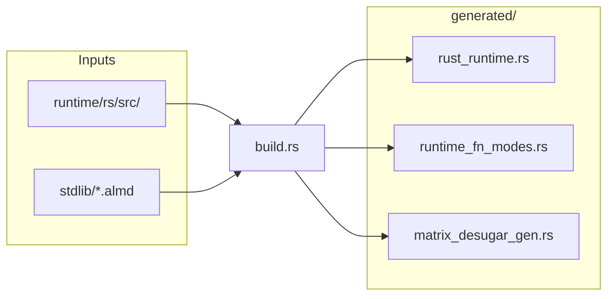
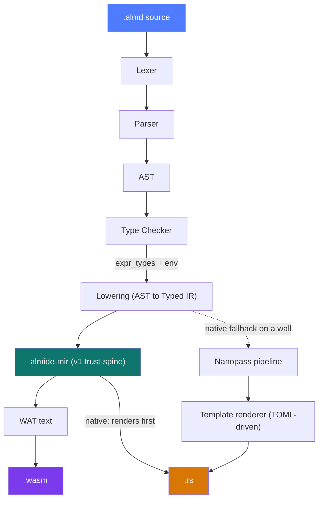
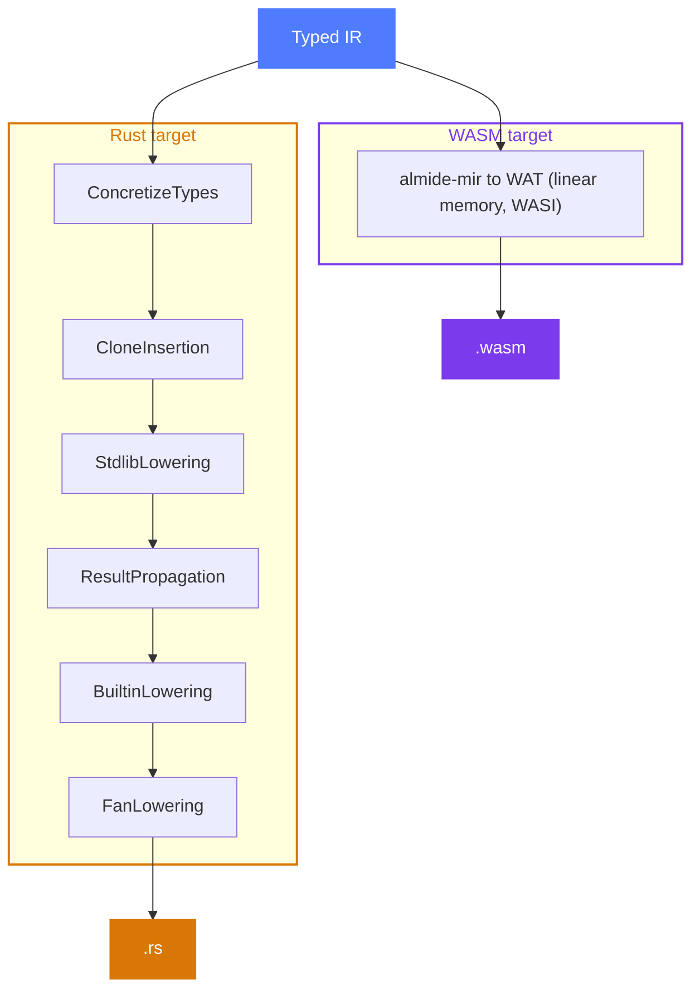

import { Tabs, TabItem, Aside, Card, CardGrid, Steps } from '@astrojs/starlight/components';

Almide is a **~183,000-line pure-Rust compiler**: a CLI binary plus 15 library crates. Dependencies: `serde` / `serde_json` (AST and IR serialization), `toml` (template loading), `clap` (CLI), `lasso` (string interning), `wat` / `wasmparser` / `wasm-encoder` (WASM), `lsp-server` / `lsp-types` (editor integration).

## Pipeline

The compiler operates in two phases: **build time** (when the compiler itself is built) and **run time** (when your `.almd` source is compiled).

### Build time — `cargo build`


```mermaid
graph LR
  subgraph Inputs
    RR["runtime/rs/src/"]
    ST["stdlib/*.almd"]
  end
  B["build.rs"]
  subgraph "generated/"
    RRT["rust_runtime.rs"]
    RFM["runtime_fn_modes.rs"]
    MDG["matrix_desugar_gen.rs"]
  end
  RR --> B
  ST --> B
  B --> RRT
  B --> RFM
  B --> MDG
```

<Aside>
  The Rust runtime and the whole standard library are **embedded in the compiler binary** via `include_str!` — the stdlib is self-hosted `.almd` source, so there is no `stdlib/defs/` and no external runtime package. When emitting Rust, the runtime is prepended to the generated `.rs` file.
</Aside>

### Run time — `almide run`


```mermaid
graph TD
  SRC[".almd source"] --> LEX["Lexer"]
  LEX --> PAR["Parser"]
  PAR --> AST["AST"]
  AST --> CHK["Type Checker"]
  CHK -->|"expr_types + env"| LOW["Lowering (AST to Typed IR)"]
  LOW --> MIR["almide-mir (v1 trust-spine)"]
  MIR --> WAT["WAT text"]
  WAT --> WOUT[".wasm"]
  MIR -->|"native: renders first"| OUT[".rs"]
  LOW -.->|"native fallback on a wall"| NP["Nanopass pipeline"]
  NP --> TR["Template renderer (TOML-driven)"]
  TR --> OUT

  style SRC fill:#4f7cff,color:#fff
  style OUT fill:#d97706,color:#fff
  style WOUT fill:#7c3aed,color:#fff
  style MIR fill:#0f766e,color:#fff
```

<Steps>
1. **Lexer** — Source text → token stream. Handles string interpolation, heredocs, 35 keywords.

2. **Parser** — Recursive descent. Produces AST with span information. Error recovery with actionable hints.

3. **Type Checker** — Constraint-based inference with eager unification. Resolves UFCS calls (`xs.map(f)` → `list.map(xs, f)`).

4. **Lowering** — AST + type information → Typed IR. Every expression carries its resolved type.

5. **almide-mir** — The v1 trust-spine. Ownership and layout are decided here, and this is what renders both targets: WAT for WASM (assembled by `wat`), and native Rust. Default on WASM since 0.29.0 and on native since 0.30.0.

6. **Output** — On WASM the trust-spine is the *only* path: a shape it cannot verify is a diagnosed wall, never a silent fallback. On native, a wall falls back to the classic nanopass + TOML template pipeline.
</Steps>

---

## Three-Layer Codegen

All semantic decisions are made in the IR before any text is emitted. The walker never checks what target it's rendering for.

### Layer 1: Nanopass Pipeline

Each pass receives `&mut IrProgram` and rewrites it structurally. Passes are composable and target-specific.


```mermaid
flowchart TD
  IR["Typed IR"]

  IR --> TC & WE

  subgraph Rust["Rust target"]
    direction TB
    TC["ConcretizeTypes"] --> CI["CloneInsertion"]
    CI --> SL["StdlibLowering"]
    SL --> RP["ResultPropagation"]
    RP --> BL["BuiltinLowering"]
    BL --> FL1["FanLowering"]
  end

  subgraph WASM["WASM target"]
    direction TB
    WE["almide-mir to WAT (linear memory, WASI)"]
  end

  FL1 --> RS[".rs"]
  WE --> WO[".wasm"]

  style IR fill:#4f7cff,color:#fff,stroke:#4f7cff
  style RS fill:#d97706,color:#fff,stroke:#d97706
  style WO fill:#7c3aed,color:#fff,stroke:#7c3aed
  style Rust stroke:#d97706,stroke-width:2px,color:#d97706
  style WASM stroke:#7c3aed,stroke-width:2px,color:#7c3aed
```

<Aside>
  The WASM target does not run the nanopass + template pipeline. It goes through `almide-mir`, which renders WAT that the `wat` crate assembles — linear memory + WASI. The bytes ship exactly as rendered unless you opt into `--wasm-opt`. (The old direct emitter, `emit_wasm/`, was retired in #782.)
</Aside>

| Pass | Target | What it does |
|------|--------|--------------|
| StdlibLowering | Rust | `Module { "list", "map" }` → `Named { "almide_rt_list_map" }` |
| ResultPropagation | Rust | Insert `Try { expr }` (Rust `?`) in `effect fn` |
| CloneInsertion | Rust | Insert `Clone` based on use-count analysis |
| BoxDeref | Rust | Insert `Deref` for recursive types through `Box` |
| BuiltinLowering | Rust | `assert_eq` → `RustMacro`, `println` → `RustMacro` |
| FanLowering | Rust | Strip auto-try from fan spawn closures |
| TailCallMark | WASM | Mark tail-recursive calls for `return_call` emission |
| ClosureConversion | WASM | Lambda capture → explicit env struct passing |

### Layer 2: Templates & Layer 3: Walker

<Tabs>
  <TabItem label="Templates">
    TOML files define syntax patterns. ~330 template rules for the Rust target.

    ```toml
    # codegen/templates/rust.toml
    [if_expr]
    template = "if ({cond}) {{ {then} }} else {{ {else} }}"

    [[power_expr]]
    when_type = "Int"
    template = "{left}.pow({right} as u32)"

    [[power_expr]]
    when_type = "Float"
    template = "{left}.powf({right})"
    ```

    All string rendering is done here — passes never produce text.
  </TabItem>

  <TabItem label="Walker">
    The walker walks the IR tree and renders each node by calling the template engine.

    It is **fully target-agnostic** — zero `if target == Rust` checks. Target differences are handled entirely by:
    - **Passes** (Layer 1) — structural rewrites
    - **Templates** (Layer 2) — syntax patterns
  </TabItem>
</Tabs>

---

## Type System

<CardGrid>
  <Card title="Inference" icon="magnifier">
    Constraint-based with eager unification.
    Walk AST → assign fresh type variables → collect constraints → unify → resolve.
  </Card>
  <Card title="UFCS" icon="right-arrow">
    `xs.map(fn)` → checker finds `builtin_module_for_type(List) = "list"` → dispatches to `list.map(xs, fn)`.
  </Card>
</CardGrid>

Key types in the type system:

```rust
Ty::Int | Ty::Float | Ty::String | Ty::Bool | Ty::Unit
Ty::List(Box<Ty>)
Ty::Map(Box<Ty>, Box<Ty>)
Ty::Option(Box<Ty>)
Ty::Result(Box<Ty>, Box<Ty>)
Ty::Record { fields: Vec<(Sym, Ty)> }
Ty::Variant { cases: Vec<VariantCase> }
Ty::Fn { params: Vec<Ty>, ret: Box<Ty> }
Ty::Tuple(Vec<Ty>)
```

---

## Crate Structure

<Tabs>
  <TabItem label="Frontend">
    ```
    crates/
    ├── almide-base/         Shared primitives
    │   ├── diagnostic.rs    Error/warning types with file:line + hint
    │   ├── intern.rs        String interning (lasso)
    │   └── span.rs          Source span types
    │
    ├── almide-syntax/       Parsing
    │   ├── ast.rs           AST node types (serde-serializable)
    │   ├── lexer.rs         Tokenizer (35 keywords, interpolation)
    │   └── parser/          Recursive descent parser
    │       ├── entry.rs         Top-level: program, imports, declarations
    │       ├── declarations.rs  fn, type, protocol, test
    │       ├── expressions.rs   Binary, unary, pipe, match, if/then/else
    │       ├── primary.rs       Literals, identifiers, lambdas
    │       ├── statements.rs    let, var, guard, assignment
    │       ├── patterns.rs      Match arm patterns
    │       ├── types.rs         Type expressions
    │       └── hints/           Smart error hints for common mistakes
    │
    ├── almide-types/        Type system
    │   ├── types/           Ty enum, unification
    │   └── stdlib_info.rs   UFCS tables, auto-import lists
    │
    └── almide-frontend/     Type checking & lowering
        ├── check/           Constraint-based type inference + UFCS
        ├── lower/           AST + Types → IR lowering, VarId assignment
        ├── type_env.rs      Scoped variables, functions, types, modules
        └── stdlib.rs        Stdlib signature registration
    ```
  </TabItem>

  <TabItem label="Backend">
    ```
    crates/
    ├── almide-ir/           Intermediate representation
    │   ├── lib.rs           IrProgram, IrExpr, IrStmt, IrPattern
    │   ├── fold.rs          IR tree walker/transformer
    │   ├── visit.rs         Read-only IR visitor
    │   ├── use_count.rs     Variable use-count analysis
    │   └── wasm_repr.rs     WASM type representation
    │
    ├── almide-optimize/     Optimization
    │   ├── mono/            Monomorphization (generic instantiation)
    │   └── optimize/        DCE, constant propagation, LICM, peephole
    │
    ├── almide-codegen/      Classic code generation (native fallback)
    │   ├── pass.rs          NanoPass trait, Pipeline, Target enum (Rust | Wasm | Wgsl)
    │   ├── target.rs        Target config: pipeline + templates
    │   ├── template.rs      TOML template engine
    │   ├── walker/          IR → Rust source renderer (target-agnostic)
    │   ├── emit_wgsl/       WGSL emitter
    │   ├── pass_*.rs        Nanopass implementations (49 passes)
    │   └── generated/       Auto-generated by build.rs (DO NOT EDIT)
    │       ├── rust_runtime.rs      Embedded Rust runtime
    │       ├── runtime_fn_modes.rs  Runtime calling modes
    │       └── matrix_desugar_gen.rs
    │
    └── almide-mir/          v1 trust-spine — the largest crate (~87k lines)
        ├── pipeline.rs      try_render_wasm_source: the single wasm entry
        ├── render_wasm/     IR → WAT, plus the stdlib link registry
        └── lower/           Ownership (Perceus), layout, drop insertion
    ```
  </TabItem>

  <TabItem label="CLI & Tools">
    ```
    src/                     CLI binary (almide)
    ├── main.rs              CLI entry, subcommands
    ├── lib.rs               Public API (playground WASM crate)
    ├── resolve.rs           Module resolution (filesystem + git deps)
    ├── project.rs           almide.toml parsing, PkgId
    ├── project_fetch.rs     Git dependency fetching
    └── cli/
        ├── run.rs           almide run: compile → rustc → execute
        ├── build.rs         almide build: compile → binary / WASM
        ├── commands.rs      almide test: find + run test blocks
        └── selfupdate.rs    almide self-update

    crates/
    ├── almide-interp/      IR tree-walker — the third cross-target oracle
    ├── almide-dialect/      Experimental dialect lowering
    ├── almide-kernel/       Proof kernel
    ├── almide-egg-lab/      e-graph rewriting experiments
    ├── almide-tools/        Tooling
    │   ├── fmt.rs           Source code formatter
    │   └── interface.rs     Module interface extraction
    │
    └── almide-lang/         Language metadata (version, feature flags)
    ```
  </TabItem>
</Tabs>

---

## Diagnostics

Every diagnostic includes structured information for both humans and tools:

```text
error[E005]: argument 'xs' expects List[Int] but got String
  at line 5
  in call to list.sort()
  hint: Fix the argument type
  |
5 | let sorted = list.sort("hello")
  |                        ^^^^^^^
```

<CardGrid>
  <Card title="Error codes" icon="error">
    Stable `Ennn` codes for programmatic consumption — 31 documented under `docs/diagnostics/`, each mapping to a specific error category. `almide explain E005` prints the long form.
  </Card>
  <Card title="Source context" icon="document">
    File:line:col location with source underline pointing to the exact span.
  </Card>
  <Card title="Actionable hints" icon="approve-check">
    Every error suggests a specific fix. The compiler is a repair tool, not a rejection tool.
  </Card>
  <Card title="Smart hints" icon="star">
    Common mistakes from other languages get targeted suggestions: `let mut` → use `var`, `&&` → use `and`, `!x` → use `not x`.
  </Card>
</CardGrid>
